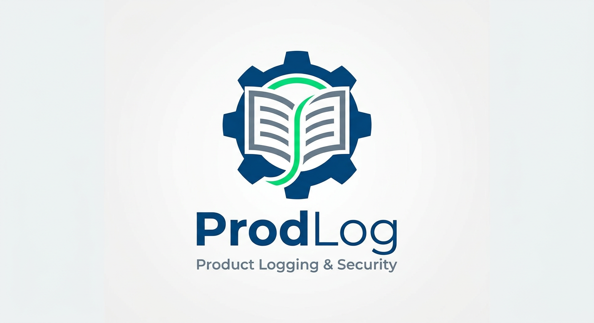

<div align="center">
  

  <h1>Prodlog</h1>

  <p>
    <strong>A local-first desktop app to track your product portfolio — tenants, products, add-ons, costs and renewals — without sending a single byte to the cloud.</strong>
  </p>

  <p>
    <a href="#download"></a>
    
    
  </p>
</div>

---

## Why

If you ship more than one side project, you eventually lose track of:

- which product runs on which host, and what it costs you each month
- when the next domain / SSL / SaaS subscription renews
- where the API keys for that thing you set up two years ago actually live
- what's still live, what's been retired, and what was just an idea

Prodlog gives every product a home. It's a private dashboard that lives on your machine, stores everything in a single SQLite file, and never asks you to log in.

## Highlights

- **Tenants → Products → Add-ons** — model how things actually live (one company, many products, each with vendors)
- **Lifecycle tracking** — `idea` → `poc` → `live` → `migrated` → `retired`
- **Cost & renewal tracking** — monthly / annual / once-off costs in any currency, with renewal dates and an upcoming-renewals view
- **Secret references, not secrets** — point to your password manager (`op://`, `bw://`, `keychain://`) instead of storing API keys
- **Repo + deployment links** — jump straight to GitHub or your live URL on Fly / Vercel / Railway / etc.
- **Local-first** — everything in one SQLite file under your app support directory; back it up however you back up files
- **No telemetry, no account, no internet required**

## Download

Pre-built binaries for macOS, Linux and Windows are published on the [Releases page](../../releases).

> macOS builds are not notarized — when first opening, right-click the app and choose **Open** to bypass Gatekeeper.

## Build from source

Requirements:

- **Node.js** 20+
- **Rust** stable (1.77+)
- **Tauri prerequisites** for your OS — see [tauri.app/start/prerequisites](https://tauri.app/start/prerequisites/)

```sh
git clone https://github.com/<you>/prodlog.git
cd prodlog
npm install
npm run tauri dev      # development
npm run tauri build    # produces a native installer in src-tauri/target/release/bundle/
```

## Tech stack

| Layer       | Choice                                |
| ----------- | ------------------------------------- |
| Shell       | Tauri 2 (Rust + native webview)       |
| UI          | React 19 + TypeScript + Vite          |
| Styling     | Tailwind CSS v4                       |
| Icons       | lucide-react                          |
| Storage     | SQLite via `tauri-plugin-sql`         |
| Bundle size | ~10 MB                                |

## Where your data lives

A single SQLite file at:

| OS      | Path                                                                |
| ------- | ------------------------------------------------------------------- |
| macOS   | `~/Library/Application Support/com.atensai.prodlog/prodlog.db`      |
| Linux   | `~/.local/share/com.atensai.prodlog/prodlog.db`                     |
| Windows | `%APPDATA%\com.atensai.prodlog\prodlog.db`                          |

To back up, just copy the file. To sync between machines, drop the directory inside iCloud / Dropbox / Syncthing and symlink it back.

## Secrets philosophy

Prodlog **never** stores raw secrets. Each add-on can carry a `secret_ref` URI that points to where the real secret lives:

```
op://Atensai/Stripe/api_key      # 1Password
bw://item-id                     # Bitwarden
keychain://service/account       # macOS Keychain
```

That way Prodlog stays useful for indexing your stack without becoming a juicy target.

## Roadmap

- [ ] Multiple deployments per product (api / worker / landing as separate rows)
- [ ] Events timeline per product
- [ ] CSV / JSON export & import
- [ ] Light/dark theme toggle
- [ ] Per-product cost breakdown chart
- [ ] Optional encrypted SQLite (SQLCipher)

## Contributing

This is a personal tool, but if you find it useful and want to add something, PRs are welcome. Keep it local-first — no analytics, no required network calls.

## License

MIT — see [LICENSE](LICENSE).

---

<div align="center">
  Made with care · <strong>Atensai</strong>
</div>
